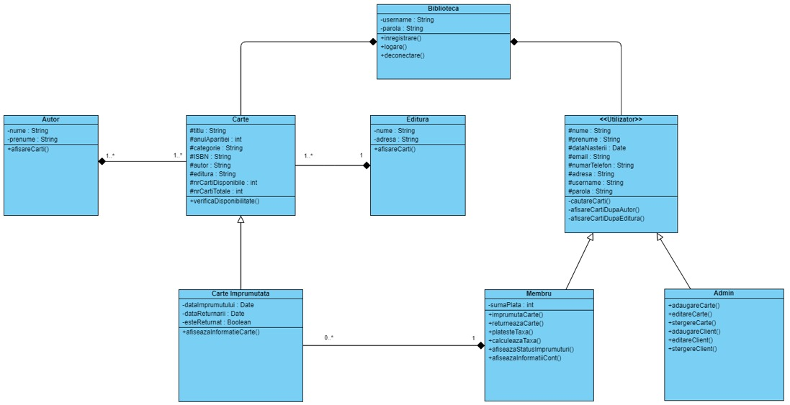
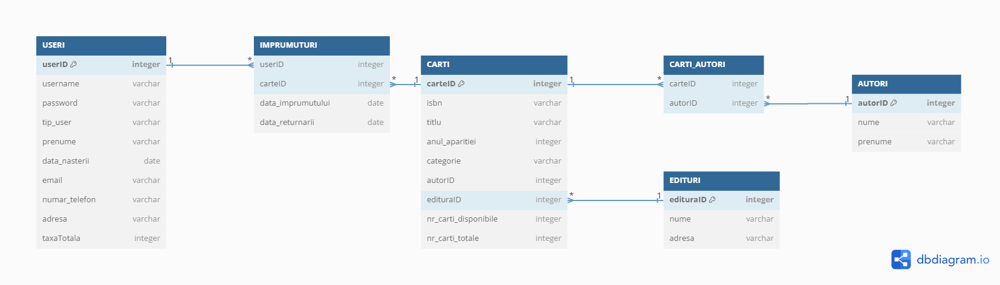

# Sistem de management al unei biblioteci
### Țogoe Radu-Mihai

## Descriere
Aplicația își propune să gestioneze clienții și catalogul de cărților unei biblioteci, fiind destinată atât personalului administrativ al acesteia, cât și clienților. Personalul bibliotecii va putea gestiona catalogul de carti, conturile de utilizator și împrumuturile efectuate.  Clienții vor putea să împrumute și să returneze cărți, să efectueze plăți și să vizualizeze informații despre cont, împrumuturi și taxe.

## Obiective
* Facilitarea serviciilor destinate clienților
	* Clienții vor putea să caute cărți, să efectueze împrumuri și să plătească taxe direct din aplicație
   * Clienții vor putea să vizualizeze informații despre împrumuturile efectuate și taxele ce trebuie plătite
* Gestionarea de conturi
	 * Crearea, editarea sau ștergea conturilor de client, vizualizarea deadline-urilor de returnare/taxelor ce trebuie plătite de către un client, confirmarea platei unei taxe/returului unei cărți
* Gestionarea catalogului de cărți
	 * Actualizarea automată a disponibilității unei cărți, adăugarea de titluri noi în catalog, eliminarea/editarea de titluri, căutarea eficientă după titlu, autor, editura
* Management-ul de taxe
	 * Eventualele taxe, precum cele de întârziere a returnării unei cărți vor fi actualizate automat pentru fiecare client 

   

## Arhitectura
   #### Arhitectura proiectului poate avea câteva modificări pe parcursul creării acestuia
   #### Diagrama claselor: 
	

#### Diagrama bazei de date

## Functionalitati/Exemple utilizare
Aplicația va dispune următoarele funcționalități:
#### Pentru accesul aplicației:
* logare
* înregistrare
* deconectare
#### Pentru client:
* Vizualizarea informatiilor despre cont, împrumuturi și taxe
* Împrumutarea și returnarea cărților
* Plătirea taxelor
#### Pentru administrator:
* Gestionarea conturilor de client 
	* creare
	*  ștergere
	*  editare
	* gestionarea împrumuturilor și taxelor efectuate de către un client 
* Gestionarea catalogului de cărți
	* adăugare cărți în catalog
	*  eliminare cărți din catalog
	* editarea informațiilor despre o carte

### Resurse
Markdown Guide, [Online] Available: https://www.markdownguide.org/basic-syntax/ [accesed: Mar 14, 1706]
